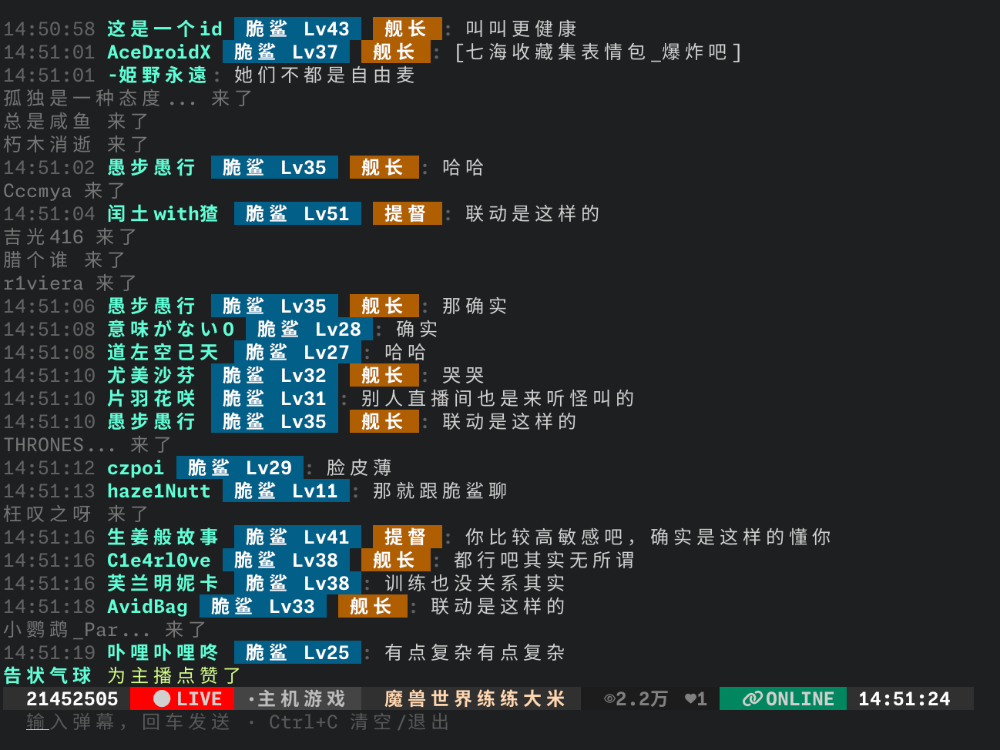

<div align="center">

# bililive-cli

bilibili终端弹幕姬

[安装](#安装) • [使用方法](#使用方法) • [开发](#开发)

<!-- README-I18N:START -->

[English](./README.md) | **中文**

<!-- README-I18N:END -->

</div>

纯文本的 bilibili 直播间弹幕姬：

- 弹幕
- 礼物
- 大航海
- 醒目留言（SC）
- 进房
- 点赞
- 关注事件
- 其他直播间状态变化
- 发送/回复弹幕



## 安装

使用 Go 1.27+ 直接安装（二进制名称会变成 `bililive-cli` 而不是 `bililive`）：

```bash
go install github.com/Arcadi4/bililive-cli@latest
```

也可以在 [GitHub Release](https://github.com/Arcadi4/bililive-cli/releases) 下载预编译二进制。

或者使用安装脚本：

```bash
curl -fsSL https://raw.githubusercontent.com/Arcadi4/bililive-cli/HEAD/install.sh | bash
```

## 使用方法

### 登录

```bash
bililive login
```

终端会打印一个二维码来通过 bilibili 移动端扫码登录。

> [!NOTE]
> 无法扫码时，可以导入浏览器的 Cookie 请求头：`bililive login --cookie "SESSDATA=...; bili_jct=..."`。`SESSDATA` 是必须的，`bili_jct` 用于发送弹幕。

会话文件位于 Linux 的 `~/.cache/bililive-cli/` 或 macOS 的 `~/Library/Caches/bililive-cli/`。

`bililive whoami` 向 bilibili 验证已保存的会话，`bililive logout` 清除会话。

### 观看直播间

```bash
# 房间号、短房间号或链接
bililive watch 42062
bililive watch 6
bililive watch https://live.bilibili.com/721

# 自己的直播间（需要登录）
bililive watch

# 管道输出时自动使用纯文本
bililive watch 1878516995 | tee room.log
```

观看时，在底部输入栏输入内容并按回车即可发送弹幕。

| 参数 | 作用 |
| --- | --- |
| `-q`, `--quiet` | 隐藏进房/点赞等噪音，保留礼物、弹幕和系统消息 |
| `--all` | 显示原始协议消息和元数据行 |
| `--plain` | 关闭底部栏和键盘输入（管道模式） |
| `--debug` | 向 stderr 输出协议诊断日志 |
| `--unicode` | 使用纯 Unicode 符号代替 Nerd Font 图标 |

### 直接发送弹幕

```bash
bililive send 1878516995 "你好"
```

### 命令一览

| 命令 | 说明 |
| --- | --- |
| `bililive watch [room]` | 关注直播间并记录互动 |
| `bililive login` | 扫码登录（`--cookie` 作为备用方式） |
| `bililive logout` | 清除已保存的会话 |
| `bililive whoami` | 验证并显示当前登录账号 |
| `bililive send <room> <message>` | 不启动界面，直接发送弹幕 |

## 开发

需要 Go 1.27。

```bash
task                                  # gofmt、go vet、构建
task run -- watch 1878516995 --plain  # 不构建直接运行
task build                            # 生成 bin/bililive
```
